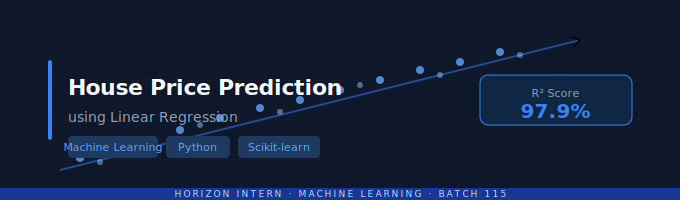
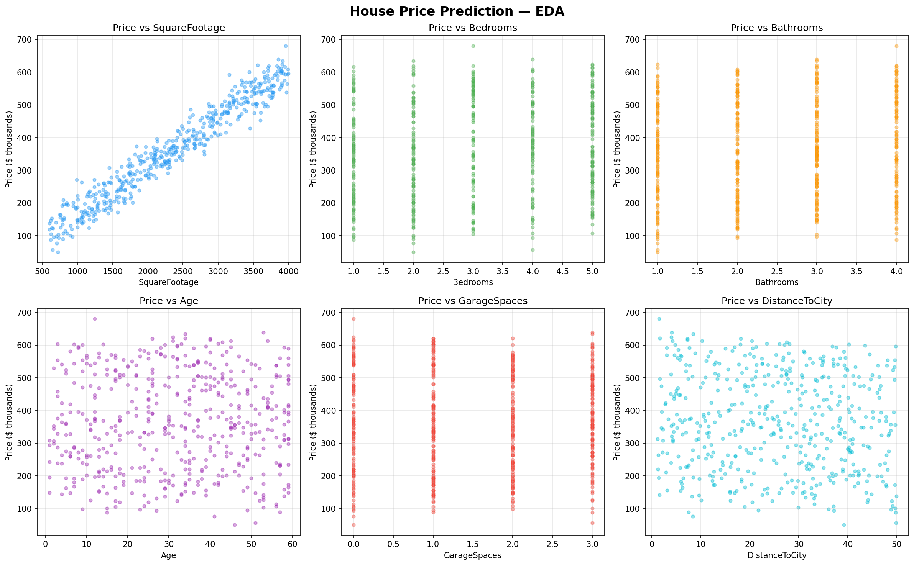
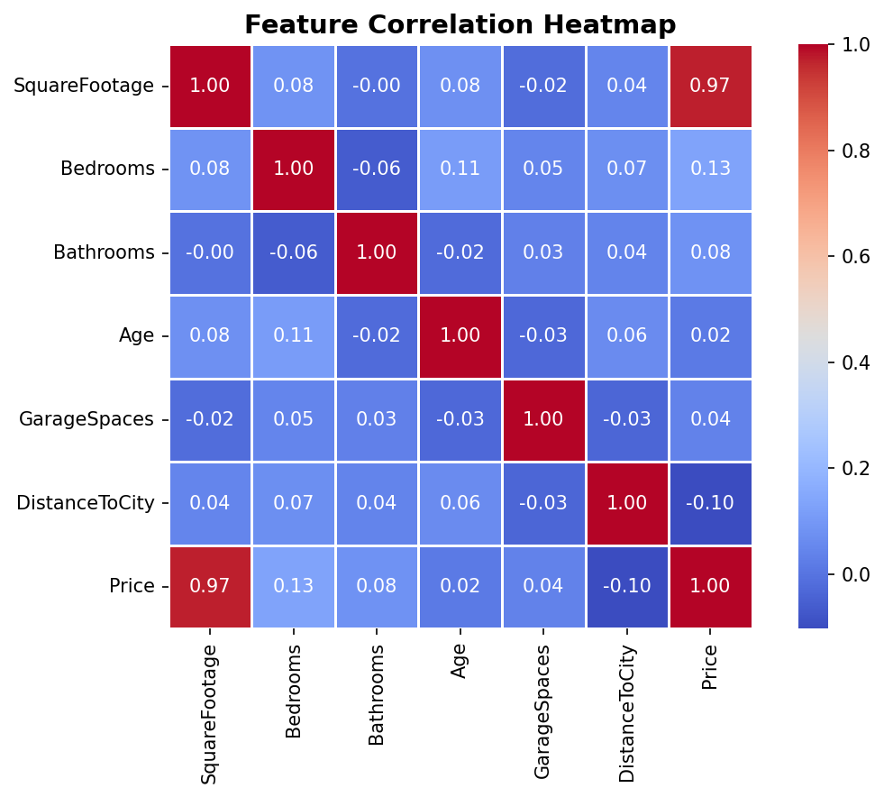
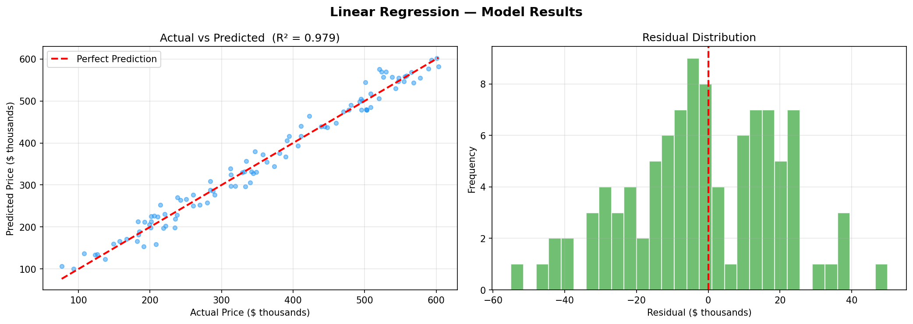
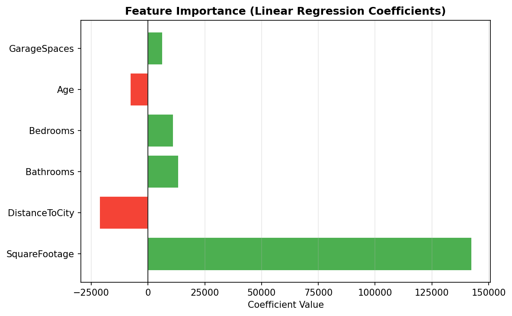

# House Price Prediction using Linear Regression

<div align="center">




**A supervised machine learning project that predicts residential property prices using Linear Regression — trained on 500 records across 6 real estate features, achieving an R² score of 97.9%.**

</div>

---

## Table of Contents
- [Project Overview](#project-overview)
- [Dataset](#dataset)
- [Project Workflow](#project-workflow)
- [Model Performance](#model-performance)
- [Screenshots](#screenshots)
- [Tech Stack](#tech-stack)
- [How to Run](#how-to-run)
- [Key Insights](#key-insights)
- [Project Structure](#project-structure)
- [Author](#author)

---

## Project Overview

Predicting house prices accurately is one of the most classic and impactful applications of machine learning in the real estate industry. This project builds a complete ML pipeline — from data generation and exploratory analysis to model training, evaluation, and live prediction.

The model takes 6 key housing features as input and outputs a predicted price in USD. It is trained using **Scikit-learn's LinearRegression** with **StandardScaler** preprocessing and evaluated on a held-out test set.

> **Predicted price for a 1800 sq ft, 3-bedroom, 2-bathroom house (10 years old, 1 garage, 12.5 km from city): $303,091.17**

---

## Dataset

The dataset consists of **500 synthetically generated** but realistically structured house records.

| Feature | Type | Description |
|--------|------|-------------|
| `SquareFootage` | Integer | Total living area in square feet (600–4000) |
| `Bedrooms` | Integer | Number of bedrooms (1–5) |
| `Bathrooms` | Integer | Number of bathrooms (1–4) |
| `Age` | Integer | Age of the property in years (1–60) |
| `GarageSpaces` | Integer | Number of garage spaces (0–3) |
| `DistanceToCity` | Float | Distance to city center in km (1–50) |
| `Price` | Float | **Target variable** — house price in USD |

**Dataset Stats:**
- Total records: 500
- Missing values: 0
- Price range: $50,000 — $680,185
- Average price: $362,856

---

## Project Workflow

```
Data Generation
      ↓
Exploratory Data Analysis (EDA)
      ↓
Feature Scaling (StandardScaler)
      ↓
Train/Test Split (80% / 20%)
      ↓
Linear Regression Model Training
      ↓
Model Evaluation (MAE, RMSE, R²)
      ↓
Feature Importance Analysis
      ↓
Live House Price Prediction
```

---

## Model Performance

| Metric | Value | Interpretation |
|--------|-------|----------------|
| **R² Score** | 0.9793 | Model explains 97.9% of price variance |
| **MAE** | $16,958.22 | Average prediction error |
| **RMSE** | $20,931.26 | Root mean squared error |

**Feature Coefficients (sorted by importance):**

| Feature | Coefficient | Effect |
|---------|-------------|--------|
| SquareFootage | +142,625 | Strongest positive driver |
| DistanceToCity | −21,410 | Strongest negative driver |
| Bathrooms | +13,563 | Positive |
| Bedrooms | +11,282 | Positive |
| Age | −7,927 | Negative |
| GarageSpaces | +6,456 | Positive |

---

## Screenshots

### 1. Exploratory Data Analysis — Feature vs Price


### 2. Feature Correlation Heatmap


### 3. Actual vs Predicted Prices & Residual Distribution


### 4. Feature Importance (Linear Regression Coefficients)


---

## Tech Stack

| Library | Version | Purpose |
|---------|---------|---------|
| Python | 3.12 | Core language |
| NumPy | 2.0.2 | Numerical operations |
| Pandas | 2.2.2 | Data manipulation |
| Scikit-learn | 1.6.1 | ML model & preprocessing |
| Matplotlib | 3.10 | Plotting |
| Seaborn | 0.13.2 | Statistical visualization |
| Streamlit | 1.45+ | Interactive web app UI |
| Altair | 5.0+ | Interactive charts and visual analytics |

---

## How to Run

**Option 1 — Google Colab (Recommended)**

Open the notebook directly in Colab and run all cells.
https://colab.research.google.com/drive/1xJH9bI9B5uII4ObEAwHW5gnkuIfF3UKc?usp=sharing

**Option 2 — Local**

```bash
# Clone the repo
git clone https://github.com/venkatasriharika-code/house-price-prediction.git
cd house-price-prediction

# Install dependencies
pip install -r requirements.txt

# Run script version
python house-price-prediction.py

# Optional: run app version
streamlit run app.py
```

---

## Key Insights

- **Square Footage** is by far the most important predictor — every additional sq ft adds ~$150 to the price
- **Distance to City** has the strongest negative impact — further from city = significantly lower price
- **Age** negatively affects price — older houses are worth less
- The **residuals are normally distributed** and centered at 0 — confirming the model assumptions are well satisfied
- The **Actual vs Predicted** plot shows points tightly hugging the perfect prediction line — indicating a high quality fit

---

## Project Structure

```
house-price-prediction/
│
├── app.py                            # Streamlit app (interactive predictor + analytics + explorer)
├── house-price-prediction.py         # Main ML pipeline script
├── house_price_prediction.ipynb      # Google Colab notebook
├── requirements.txt                  # Python dependencies
├── screenshot1_eda_scatter.png       # EDA visualizations
├── screenshot2_correlation_heatmap.png # Correlation heatmap
├── screenshot3_model_results.png     # Model evaluation plots
├── screenshot4_feature_importance.png # Feature importance plot
├── house_price_banner.svg            # Project banner
└── README.md                         # Project documentation
```

---

## Author

<div align="center">

**Venkata Sriharika Prathipati**

Machine Learning Intern — Horizon Intern | Batch 115

[](https://github.com/venkatasriharika-code)
[](https://linkedin.com/in/venkata-sriharika-prathipati-b9491b300)

</div>

---

*Built as part of the Horizon Intern Virtual Internship Program — Machine Learning Domain, Batch 115*
